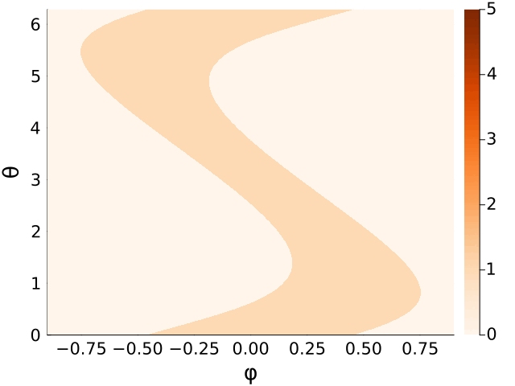
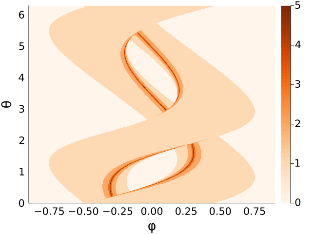
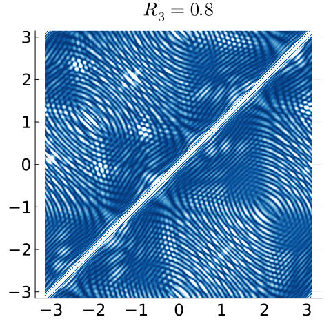

# Multi-dimensional Chaos I: Classical and Quantum Mechanics

This page indexes supplementary material to the paper <a href=https://arxiv.org/abs/2510.03007>arXiv:hep-th/2510.03007</a>.

* The [Quantum pinball Julia notebook](../code/Julia/Quantum%20pinball.ipynb) contains the code to compute the scattering amplitude for the two- and three-disk quantum pinball analyzed in the paper. It is written to be generalizable to the n-disk system as well.

* Below are several animated plots, showing the transition from non-chaotic to chaotic pinball systems:

<table>
  <tr>
    <td></td>
  </tr>
  <tr>
    <td colspan="2" align="center">Transition from 1 to 3 disks in the classical pinball system. </td>
  </tr>
</table>

<table>
  <tr>
    <td></td>
  </tr>
  <tr>
    <td colspan="2" align="center">Transition from 2 to 3 disks in the classical pinball system. </td>
  </tr>
</table>

<table>
  <tr>
    <td></td>
  </tr>
  <tr>
    <td colspan="2" align="center">Gradual transition from 2 to 3 disks in the quantum pinball system. </td>
  </tr>
</table>
