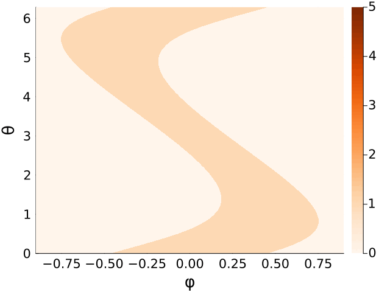

# Multi-dimensional Chaos I: Classical and Quantum Mechanics

Here are supplementary animated figures to the paper <a href=https://arxiv.org/abs/2510.03007>arXiv:hep-th/2510.03007</a>.

<table>
  <tr>
    <td></td>
  </tr>
  <tr>
    <td colspan="2" align="center">Transition from 1 to 3 disks in the classical pinball system. </td>
  </tr>
</table>

<table>
  <tr>
    <td></td>
  </tr>
  <tr>
    <td colspan="2" align="center">Transition from 2 to 3 disks in the classical pinball system. </td>
  </tr>
</table>

<table>
  <tr>
    <td></td>
  </tr>
  <tr>
    <td colspan="2" align="center">Gradual transition from 2 to 3 disks in the quantum pinball system. </td>
  </tr>
</table>
